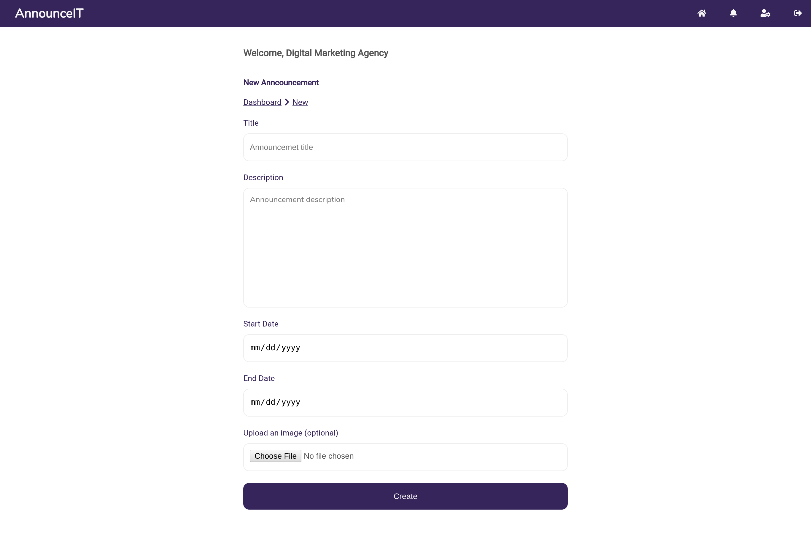

## announceIT
AnnounceIT is a solution for broadcasting agencies which allows them to be able to receive and manage announcements.
***

### User Interface
[UI Preview](https://the22mastermind.github.io/announceIT/)

### Technologies/tools used
* HTML
* CSS
* JavaScript

### Screenshots
#### 1. Home page/ sign up page

#### 2. Signin page

#### 3. Request password reset page

#### 4. Password reset page

#### 5. Announcements feed page

#### 6. Advertiser view all their announcements page

#### 7. Advertiser view announcements of specific state

#### 8. Advertiser view specific announcement page

#### 9. Advertiser create announcement page

#### 10. Advertiser update announcement page

#### 11. Admin delete announcement

#### 12. Admin change status of announcement

#### 13. Admin view announcements from all users

#### 14. Admin add user on blacklist

#### 15. User flag announcement
